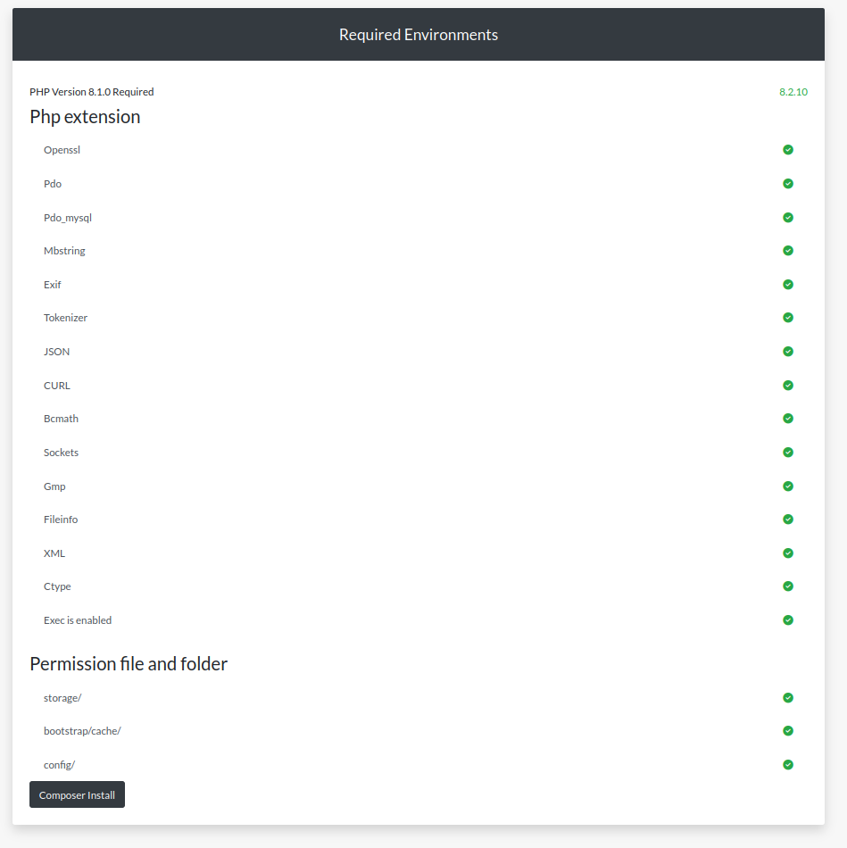
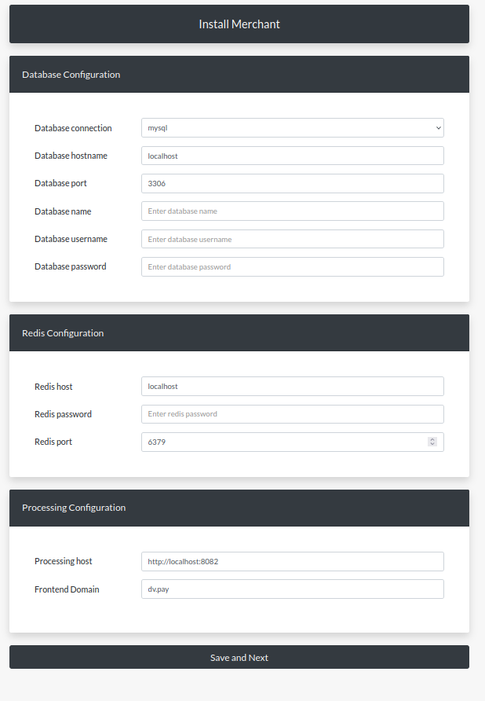
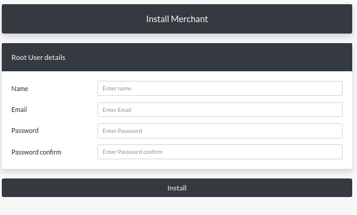

# Install

To install the product you will need a server with a Linux operating system, we recommend using the centos distribution
and you need to install the following software:

1. Nginx
2. php 8.1^ and php extension cli,fpm,mysqlnd,pdo_mysql,zip,devel,gd,mbstring,curl,xml,pear,bcmath,json,pecl-redis5,exif,pcntl,sockets,gmp
3. composer
4. redis
5. Database mysql percona and database need make with collation utf8mb4_unicode_ci
6. node 18^ and npm 
7. global installed vite package for install ``` npm install -g vite```
8. supervisor

The merchant consists of two applications: a backend on laravel and a frontend on vue.js

Place the merchant backend in a location convenient for you, for example in the user directory server /home/server/merchant.com
and place the frontend code in the frontend folder /home/server/merchant.com/frontend

edit nginx for you merchant api

```
server {
    listen 80;
    server_name api.merchant.com;

    add_header 'Access-Control-Allow-Headers' '*' always;
    add_header 'Access-Control-Allow-Origin' '*' always;

    root        /home/server/merchant.com/public;
    index       index.php;

    location / {
        try_files $uri $uri/ /index.php?$args;
    }

    location ~ \.php$ {
        include fastcgi.conf;
        fastcgi_pass unix:/var/run/php-fpm.sock;
    }

    location ~ /\.(ht|svn|git) {
            deny all;
    }
}
```

and nginx config for control panel

```
server {
    listen 80;
    server_name merchant.com;

    root        /home/server/merchant.com/frontend/dist;
    index       index.html;

    location / {
            try_files $uri $uri/ /index.html?$args;
    }

    location ~ /\.(ht|svn|git) {
            deny all;
    }

}
```

nginx config for checkout page

```
server {
    listen 80;
    server_name pay.merchant.com;

    root        /home/server/merchant.com/frontend/dist;
    index       checkout.html;

    location / {
            try_files $uri $uri/ /checkout.html?$args;
    }

    location ~ /\.(ht|svn|git) {
            deny all;
    }

}
```

if you did everything correctly, you can proceed with the web installation

open page for installation http://merchant.com/install where merchant.com you domain



the composer install button will install all the necessary dependencies for the backend application

after installing the dependencies you should redirect to the page http://merchant.com/setup



on this page you enter all your data from the database
redis and specify the processing url

at this stage, all access to the .env file will be established, as well as migrations to the database will be completed and your merchant will be registered in processing

if everything went well you should be redirected to the last page



On this page you need to enter your details from the merchant’s personal account

At this step, a user with all privileges will be registered and the frontend part of the application will be assembled

after successful installation you can start using the merchant

example config for supervisor
how start supervisor you can read on laravel doc
https://laravel.com/docs/10.x/queues#supervisor-configuration

```
[program:laravel-worker]
command=php /home/server/backend/www/artisan queue:work --queue=default,transfer,notifications,monitor
process_name=%(program_name)s_%(process_num)02d
numprocs=8
priority=999
autostart=true
autorestart=true
startsecs=1
startretries=3
user=server
redirect_stderr=true
stdout_logfile=/home/server/backend/www/storage/logs/supervisord.log
```
